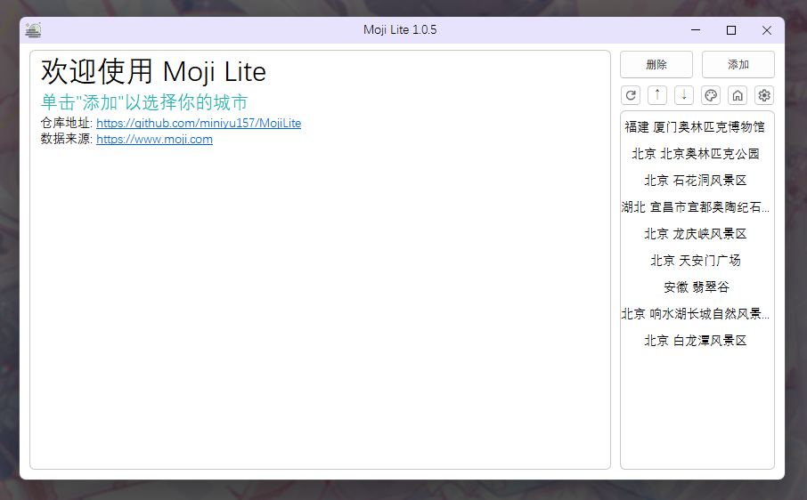
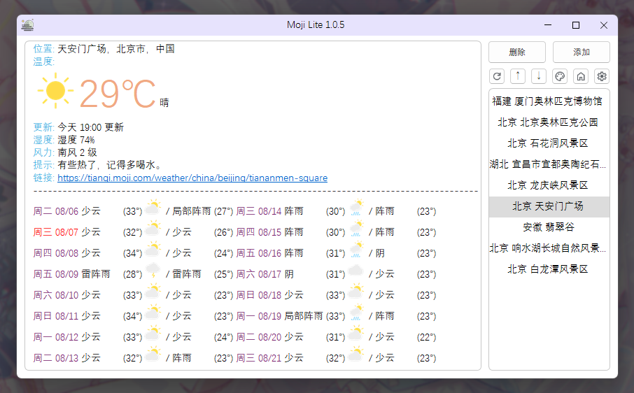
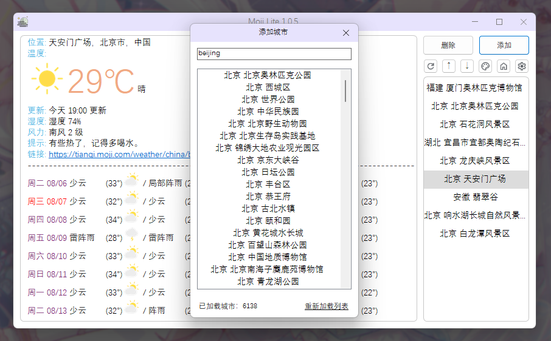

# Moji Lite


轻量级墨迹天气PC端

## 使用

- 单击 ```添加城市``` 以使用，可以在 [releases](https://github.com/miniyu157/MojiLite/releases) 页面下载

## 细节

- 缓存文件位于 ```\cache``` 文件夹中，包含缓存的图像、城市列表等
- 添加城市时支持拼音搜索
- 使用了库 [KlxPiao - KlxPiaoAPI](https://github.com/miniyu157/KlxPiao) 用于字符串解析和提取，数据处理、图像处理等
- 使用了库 [KlxPiao - KlxPiaoControl](https://github.com/miniyu157/KlxPiao)
- 使用了库 [FabioJe/INIParser](https://github.com/FabioJe/INIParser) 用于解析配置文件

## 预览





